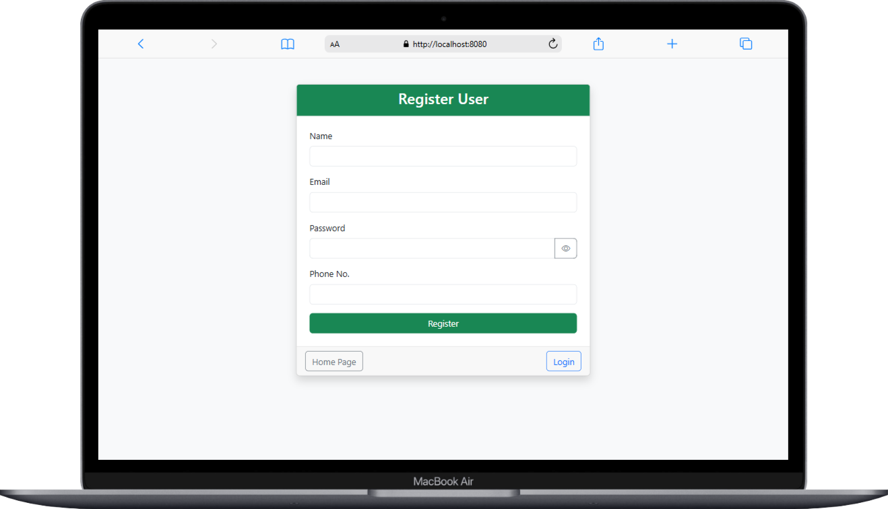
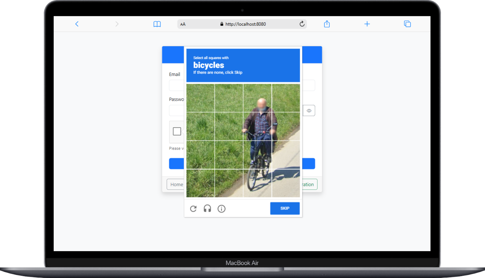

# Spring Registration System with reCAPTCHA

A secure user registration and login system built with Spring Boot, featuring Google reCAPTCHA integration to prevent automated bot submissions.

## Project Overview

This application provides a complete user authentication system with:

- User registration
- Secure login with reCAPTCHA verification
- User profile management
- Session management

## Features

- **User Registration**: Simple form to collect user information
- **Secure Login**: Email and password authentication with reCAPTCHA protection
- **Password Security**: Password toggle visibility option
- **Responsive Design**: Built with Bootstrap 5 for a mobile-friendly experience
- **Database Integration**: MySQL database for user data storage
- **Session Management**: Proper session handling with logout functionality

## Technology Stack

- **Backend**: Spring Boot, Spring MVC, Spring Data JPA
- **Frontend**: Thymeleaf, Bootstrap 5, HTML/CSS/JavaScript
- **Security**: Google reCAPTCHA v2
- **Database**: MySQL
- **Build Tool**: Maven

## Project Structure

```
SpringRegistration/
├── src/
│   ├── main/
│   │   ├── java/
│   │   │   └── com/rrb/SpringRegistration/
│   │   │       ├── controllers/
│   │   │       │   └── Mycontroller.java
│   │   │       ├── entities/
│   │   │       │   └── User.java
│   │   │       ├── repositories/
│   │   │       │   └── UserRepository.java
│   │   │       ├── services/
│   │   │       │   ├── UserService.java
│   │   │       │   └── UserServiceImpl.java
│   │   │       └── SpringRegistrationApplication.java
│   │   └── resources/
│   │       ├── static/
│   │       │   └── index.html
│   │       ├── templates/
│   │       │   ├── login.html
│   │       │   ├── profile.html
│   │       │   └── register.html
│   │       └── application.properties
│   └── test/
└── pom.xml
```

## Setup Instructions

### Prerequisites

- JDK 17 or higher
- Maven
- MySQL Server
- Google reCAPTCHA API keys (Site Key and Secret Key)

### Database Configuration

The application is configured to connect to a MySQL database. Update the database configuration in `application.properties`:

```properties
spring.datasource.url=jdbc:mysql://localhost:3306/user_db?createDatabaseIfNotExist=true
spring.datasource.username=your_username
spring.datasource.password=your_password
```

### reCAPTCHA Configuration

To enable reCAPTCHA functionality:

1. Register for reCAPTCHA API keys at [Google reCAPTCHA Admin Console](https://www.google.com/recaptcha/admin)
2. Update the following constants in `Mycontroller.java`:
   ```java
   private static final String RECAPTCHA_SITE_KEY = "your_site_key";
   private static final String RECAPTCHA_SECRET_KEY = "your_secret_key";
   private static final String RECAPTCHA_VERIFY_URL = "https://www.google.com/recaptcha/api/siteverify";
   ```

### Running the Application

1. Clone the repository
2. Navigate to the project directory
3. Run the application using Maven:
   ```
   mvn spring-boot:run
   ```
4. Access the application at `http://localhost:8080`

## Screenshots

### Registration Page


### Login Page with reCAPTCHA


### reCAPTCHA Verification Page


### Profile Page


## Usage

1. **Registration**: Navigate to `/register` to create a new account
2. **Login**: Navigate to `/login` to sign in with your credentials and complete the reCAPTCHA verification
3. **Profile**: After successful login, you'll be redirected to your profile page
4. **Logout**: Click the logout button to end your session

## Security Considerations

- The application implements reCAPTCHA to prevent automated bot submissions
- Passwords should be properly hashed before storing in the database (implementation required)
- Consider adding CSRF protection for production use

## Future Enhancements

- Email verification for new registrations
- Role-based access control
- Enhanced profile management
- Remember me functionality


## Author

[atharvapimparkar1416@gmail.com/[Atharva-2510(https://github.com/Atharva-2510/CAPTCHA-VERIFICATION)]